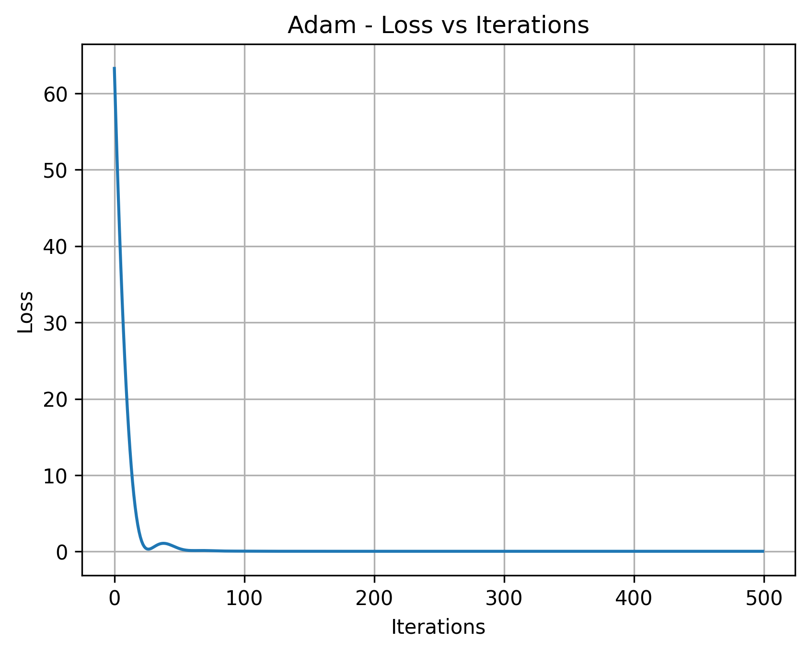
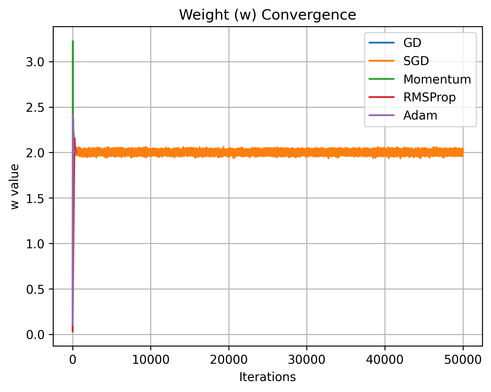

# ML Optimizer Visualizer  
**Compare optimization algorithms in linear regression with synthetic data**  
  

This project lets you visually compare five classic optimization algorithms on a simple **1D linear regression** task using synthetic data:

- **Gradient Descent (GD)**
- **Stochastic Gradient Descent (SGD)**
- **Momentum**
- **RMSProp**
- **Adam**

You can observe convergence speed, stability, oscillation behavior, and how each optimizer handles varying gradient magnitudes and noise.

## ✨ Features

- Generate **controllable synthetic linear data** (adjust noise, feature scale, true parameters)
-  Five optimizers implemented **from scratch** (no PyTorch/TensorFlow)
-  Rich visualizations:
  - Loss curves (linear + log scale)
  - Parameter trajectories (`w` and `b`)
  - Combined comparison plots
- Quantitative summary table (final loss + iterations to reach threshold)
- Plots automatically saved to `outputs/` folder

## Example Results

### Summary Table

```text
Optimizer Comparison Summary
──────────────────────────────────────────────────
Optimizer   | Final Loss   | Iters < 0.05
──────────────────────────────────────────────────
GD          | 0.032646     | 255
SGD         | 0.039081     | 248
Momentum    | 0.032568     | 240
RMSProp     | 0.032864     | 308
Adam        | 0.032512     | 99
```

→ **Adam reaches a good loss region ~2.5× faster** (in iteration count) in this run.

### Visualizations

#### Adam – Loss Curve


#### All Optimizers – Weight (`w`) Convergence


> Adam converges to the true value fastest and remains very stable. SGD shows the most post-convergence jitter.


## Dataset

Synthetic data is generated according to:

$$
y = w_{\text{true}} \cdot x + b_{\text{true}} + \epsilon, \quad \epsilon \sim \mathcal{N}(0, \sigma^2)
$$

Characteristics designed to highlight optimizer differences:

- **Mixed feature scales**: small (~0–0.5), medium (~1.5–3), large (~5–6) values → creates varying gradient magnitudes
- **Gaussian noise** → realistic stochastic fluctuations
- **Shuffled order** → prevents any artificial ordering advantage

Default parameters:  
`w_true = 2.0`, `b_true = 3.0`, `noise_std = 0.2`

## Installation

```bash
# Clone the repository
git clone https://github.com/adiManethia/ML-Optimizer-Visualizer.git

# Enter the project directory
cd ML-Optimizer-Visualizer

# Install dependencies (very lightweight)
pip install -r requirements.txt
# → numpy, matplotlib

# Start
python main.py
```

## Why Adam Usually Wins in This Setup
- Mixed gradient magnitudes across the feature range → benefits from per-parameter learning rate adaptation
- Noise introduces stochasticity → Adam's combination of momentum + adaptive scaling handles fluctuations well
- Bias correction helps during the early training phase
- With a reasonably tuned learning rate, Adam often converges much faster on this kind of simple-but-not-perfectly-scaled problem

## Project Structure
```bash
ml-optimizers-visualized/
│
├── optimizers/
│   ├── gd.py
│   ├── sgd.py
│   ├── momentum.py
│   ├── rmsprop.py
│   └── adam.py
│
├── utils/
│   ├── data.py
│   ├── loss.py
│   └── visualize.py
│
├── outputs/                # Folder where all generated plots are saved
│   ├── loss_gd.png
│   ├── loss_sgd.png
│   ├── loss_momentum.png
│   ├── loss_rmsprop.png
│   ├── loss_adam.png
│   ├── w_convergence.png
│   ├── b_convergence.png      
│   
├── main.py
├── README.md
├── requirements.txt
└── .gitignore
```


